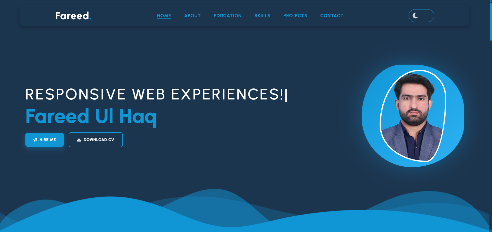

  

  

  

## 💻 About Me

- 💻 **Role:** Detail-oriented Front-End Developer
- 🎨 **Focus:** Modern UI, Mobile-First Design & Responsive Web Apps
- 🚀 **Tech Stack:** HTML5, CSS3, JavaScript, & Bootstrap
- 🌱 **Currently Learning:** Expanding my skills with C# & .NET Core, & SQL Server
- 💼 **Freelance:** Actively delivering premium projects on Upwork
- ⚡ **Design Preference:** Clean, Minimalist & Distraction-Free Interfaces

  

## 🛠️ Skills

  
  

  

## 🚀 Featured Project

<table border="0" width="100%">
  <tr>
    <td width="45%" valign="center">
      <h3>🌐 Personal Portfolio</h3>
      
A custom-built, fully responsive portfolio website designed to showcase my front-end layout architecture and UI skills.

      <b>Technologies Used:</b>   
      
    </td>
    <td width="55%" align="center" valign="center">
      
    </td>
  </tr>
</table>

  

## 📊 GitHub Stats

  

  

## 🤝 Connect With Me

  
  &nbsp;&nbsp;&nbsp;&nbsp;
  
  &nbsp;&nbsp;&nbsp;&nbsp;
  
  &nbsp;&nbsp;&nbsp;&nbsp;
  

  

  <h3>Thanks for visiting my profile!</h3>

